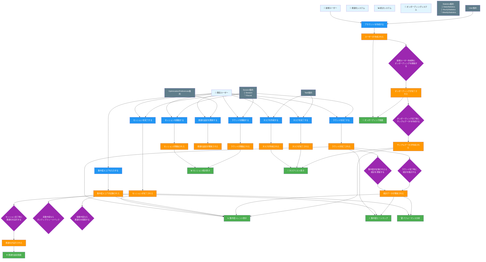

# Self Pomodoro アプリケーション - イベントストーミング図

## 概要
このドキュメントでは、Self Pomodoroアプリケーションの現在のDDD設計に基づいたイベントストーミングを示します。

## イベントストーミング図 (Mermaid)



## 詳細な要素説明

### 👤 アクター (Actors)
- **新規ユーザー**: アプリをダウンロードして初回利用する人
- **既存ユーザー**: 既にアカウントを持ちPomodoroセッションを実行する人
- **最適化システム**: 機械学習による自動最適化を実行
- **統計システム**: データ集計とレポート生成を担当
- **オンボーディングシステム**: 新規ユーザーの初期設定とサンプルデータ作成

### 📋 コマンド (Commands)
0. **アカウントを作成する** - 新規ユーザー登録とプロフィール設定
1. **セッションを開始する** - 新しいPomodoroセッションを開始
2. **ラウンドを開始する** - セッション内の作業ラウンドを開始
3. **ラウンドを完了する** - 作業ラウンドを終了し、集中度を記録
4. **セッションを完了する** - 全セッションを終了
5. **最適化設定を更新する** - 作業時間・休憩時間の設定を変更
6. **集中度スコアを入力する** - ラウンド終了時に主観的集中度を記録
7. **タスクを作成する** - 新しいタスクをリストに追加
8. **タスクを完了する** - タスクを完了状態にマーク

### 🔥 ドメインイベント (Domain Events)
0. **ユーザーが作成された** - 新規ユーザー登録完了、User集約から発生
1. **セッションが開始された** - Session集約から発生
2. **ラウンドが開始された** - Session集約内のRoundから発生
3. **ラウンドが完了された** - 作業ラウンド終了と集中度記録完了
4. **セッションが完了された** - 全ラウンド完了とセッション統計確定
5. **最適化設定が更新された** - OptimizationPreferences変更完了
6. **集中度スコアが記録された** - ユーザー入力による主観的評価確定
7. **タスクが作成された** - 新しいタスクがシステムに登録
8. **タスクが完了された** - タスクの状態変更完了
9. **統計データが更新された** - Daily/Hourly/Weekly統計の更新完了
10. **最適化が実行された** - 機械学習による設定最適化完了
11. **オンボーディングが完了された** - 新規ユーザーの初期設定完了
12. **サンプルデータが作成された** - デモ用の統計データとタスク作成完了

### 🔄 ポリシー (Policies)
0. **新規ユーザー作成時にオンボーディングを開始する** - 初期設定と体験向上
1. **集中度が記録されたら統計を更新する** - リアルタイム統計集計
2. **セッション完了時に最適化を実行する** - パフォーマンスデータを基にした自動調整
3. **ラウンド完了時に統計を集計する** - 日次・時間別統計の即座更新
4. **高集中度ならポジティブフィードバック** - モチベーション向上のための通知
5. **低集中度なら最適化を提案する** - 改善案の自動生成
6. **オンボーディング完了時にサンプルデータを作成する** - アプリ体験向上のためのデモデータ提供

### 📊 ビュー/リードモデル (Views/Read Models)
0. **オンボーディング画面** - 新規ユーザー向けの初期設定とチュートリアル
1. **集中度トレンド表示** - 日別・週別の集中度推移グラフ
2. **集中度ヒートマップ** - 時間帯別集中度の可視化
3. **セッション統計表示** - リアルタイムセッション進捗
4. **最適化設定画面** - 作業時間・休憩時間の設定UI
5. **タスクリスト表示** - 進行中・完了済みタスクの一覧
6. **パフォーマンス分析** - 週・月単位の詳細分析レポート

### 🏗️ 集約 (Aggregates)
1. **Session集約**: Session + Round (1対多)
   - セッション状態管理と一貫性保証
   - ラウンド追加・完了の制御
   
2. **OptimizationPreferences集約**: 
   - ユーザー個別の最適化設定
   - 作業時間・休憩時間・ラウンド数の管理
   
3. **Statistics集約**: Daily/Hourly/Weekly統計
   - 時系列データの集計と整合性
   - 複数粒度での統計計算
   
4. **Task集約**: 
   - タスク生命周期管理
   - 完了状態の制御
   
5. **User集約**: 
   - ユーザー基本情報管理
   - 認証・認可の基盤

## ビジネス価値とユーザージャーニー

### 💡 主要なユーザージャーニー

1. **新規ユーザーオンボーディングフロー**:
   ```
   アプリダウンロード → アカウント作成 → オンボーディング開始 → 初期設定 → サンプルデータ作成 → チュートリアル → 初回セッション
   ```

2. **セッション実行フロー**:
   ```
   既存ユーザー → セッション開始 → ラウンド実行 → 集中度記録 → 統計更新 → 最適化提案
   ```

3. **設定最適化フロー**:
   ```
   セッション完了 → 機械学習分析 → 最適化提案 → 設定更新 → パフォーマンス向上
   ```

4. **長期分析フロー**:
   ```
   継続利用 → データ蓄積 → トレンド分析 → パターン発見 → 個人化最適化
   ```

このイベントストーミング図は、現在のDDD設計と完全に整合しており、ドメイン駆動設計の原則に従った適切な責務分離と集約境界を反映しています。