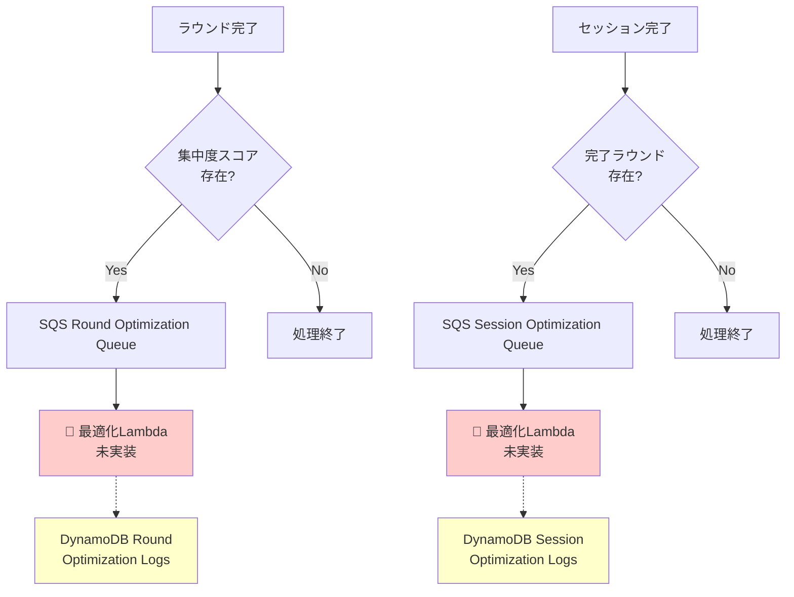

# 最適化ログのDynamoDB処理関係性

## 現在の実装状況

⚠️ **重要**: 最適化計算処理は**未実装**です。現在は SQS メッセージ送信まで実装済み。

## アーキテクチャ概要



## 実装済み部分

### ✅ SQS メッセージ送信
- **ラウンド完了時**: `SendRoundOptimizationMessage()` 実装済み
- **セッション完了時**: `SendSessionOptimizationMessage()` 実装済み

### ✅ DynamoDB テーブル定義
```go
// Round Optimization Log
type RoundOptimizationLog struct {
    UserID     string `dynamodb:"user_id" json:"user_id"`         // PK
    Timestamp  string `dynamodb:"timestamp" json:"timestamp"`     // SK
    WorkTime   int    `dynamodb:"work_time" json:"work_time"`     // 推奨作業時間
    BreakTime  int    `dynamodb:"break_time" json:"break_time"`   // 推奨休憩時間
    FocusScore int    `dynamodb:"focus_score" json:"focus_score"` // 集中度スコア
    CreatedAt  string `dynamodb:"created_at" json:"created_at"`
}

// Session Optimization Log
type SessionOptimizationLog struct {
    UserID        string  `dynamodb:"user_id" json:"user_id"`                 // PK
    Timestamp     string  `dynamodb:"timestamp" json:"timestamp"`             // SK
    RoundCount    int     `dynamodb:"round_count" json:"round_count"`         // 推奨ラウンド数
    BreakTime     int     `dynamodb:"break_time" json:"break_time"`           // 推奨長休憩時間
    AvgFocusScore float64 `dynamodb:"avg_focus_score" json:"avg_focus_score"` // 平均集中度
    TotalWorkTime int     `dynamodb:"total_work_time" json:"total_work_time"` // 総作業時間
    CreatedAt     string  `dynamodb:"created_at" json:"created_at"`
}
```

### ✅ 環境設定
```bash
# DynamoDB テーブル
DYNAMO_ROUND_OPTIMIZATION_TABLE=selfpomodoro_round_optimization_logs_dev
DYNAMO_SESSION_OPTIMIZATION_TABLE=selfpomodoro_session_optimization_logs_dev

# SQS キュー
SQS_ROUND_OPTIMIZATION_URL=https://sqs.ap-northeast-1.amazonaws.com/545009834501/selfpomodoro-round-optimization-dev
SQS_SESSION_OPTIMIZATION_URL=https://sqs.ap-northeast-1.amazonaws.com/545009834501/selfpomodoro-session-optimization-dev
```

## 🚧 未実装部分

### 最適化 Lambda 関数
現在、以下の処理が未実装です：

1. **SQS メッセージ受信**
2. **最適化アルゴリズム実行**
3. **結果の DynamoDB 保存**

### 想定される処理フロー

```go
// 未実装の最適化Lambda関数の想定処理
func optimizationHandler(ctx context.Context, sqsEvent events.SQSEvent) error {
    for _, record := range sqsEvent.Records {
        // 1. メッセージ解析
        var message RoundOptimizationMessage
        json.Unmarshal([]byte(record.Body), &message)
        
        // 2. 最適化計算（未実装）
        optimizedWorkTime := calculateOptimalWorkTime(message.FocusScore)
        optimizedBreakTime := calculateOptimalBreakTime(message.FocusScore)
        
        // 3. DynamoDBに保存（未実装）
        log := &RoundOptimizationLog{
            UserID:     message.UserID,
            Timestamp:  time.Now().Format(time.RFC3339),
            WorkTime:   optimizedWorkTime,
            BreakTime:  optimizedBreakTime,
            FocusScore: message.FocusScore,
            CreatedAt:  time.Now().Format(time.RFC3339),
        }
        
        // repo.Save(ctx, log) // 未実装
    }
}
```

## 現在の動作

1. **ラウンド完了** → SQS メッセージ送信 → **キューに蓄積**
2. **セッション完了** → SQS メッセージ送信 → **キューに蓄積**

⚠️ **メッセージは送信されますが、処理されずにキューに蓄積されます**

## サンプルデータ作成機能

✅ 開発・テスト用にサンプル最適化ログを作成する機能は実装済み：
- `CreateRoundOptimizationLogs()`: ラウンド最適化ログのサンプル作成
- `CreateSessionOptimizationLogs()`: セッション最適化ログのサンプル作成

## 次に必要な実装

1. **最適化アルゴリズム**の設計・実装
2. **SQS 処理 Lambda** の作成
3. **DynamoDB 保存処理**の実装
4. **UserConfig 自動更新処理**の実装
5. **serverless.yml** への Lambda 関数定義追加

## 最適化パラメータと計算値

### ラウンド最適化
**入力パラメータ**:
- `FocusScore`: 集中度スコア (0-100, ユーザーが入力)

**最適化される値**:
- `WorkTime`: 次回ラウンドの推奨作業時間（分）
- `BreakTime`: 次回ラウンドの推奨休憩時間（分）

**最適化結果の適用**:
最適化処理完了後、計算された最新の値が `UserConfig` に自動挿入されます：
- `RoundWorkTime`: 最適化された作業時間
- `RoundBreakTime`: 最適化された休憩時間

### セッション最適化
**入力パラメータ**:
- `AvgFocusScore`: セッションの平均集中度スコア (0-100)
- `TotalWorkTime`: セッションの総作業時間（分）

**最適化される値**:
- `RoundCount`: 次回セッションの推奨ラウンド数
- `BreakTime`: 次回セッションの推奨長休憩時間（分）

**最適化結果の適用**:
最適化処理完了後、計算された最新の値が `UserConfig` に自動挿入されます：
- `SessionRounds`: 最適化されたラウンド数  
- `SessionBreakTime`: 最適化された長休憩時間

## UserConfig との連携

### UserConfig 構造
```go
type UserConfig struct {
    UserID           string    `dynamodb:"user_id" json:"user_id"`
    RoundWorkTime    int       `dynamodb:"round_work_time" json:"round_work_time"`       // 作業時間（分）
    RoundBreakTime   int       `dynamodb:"round_break_time" json:"round_break_time"`     // 休憩時間（分）
    SessionRounds    int       `dynamodb:"session_rounds" json:"session_rounds"`         // ラウンド数
    SessionBreakTime int       `dynamodb:"session_break_time" json:"session_break_time"` // 長休憩時間（分）
    CreatedAt        time.Time `dynamodb:"created_at" json:"created_at"`
    UpdatedAt        time.Time `dynamodb:"updated_at" json:"updated_at"`
}
```

### 最適化フロー
```
ラウンド最適化 → DynamoDB保存 → UserConfig.RoundWorkTime/RoundBreakTime 更新
セッション最適化 → DynamoDB保存 → UserConfig.SessionRounds/SessionBreakTime 更新
```

**次回利用時**: ユーザーがセッション/ラウンドを開始すると、最適化されたUserConfig設定値が自動適用されます。

## DynamoDB格納データ構造

### Round Optimization Logs テーブル
```json
{
  "user_id": "550e8400-e29b-41d4-a716-446655440000",
  "timestamp": "2025-06-25T10:30:00Z",
  "work_time": 25,        // 次回推奨作業時間（分）
  "break_time": 5,        // 次回推奨休憩時間（分）
  "focus_score": 75,      // このラウンドの実績集中度
  "created_at": "2025-06-25T10:30:00Z"
}
```

### Session Optimization Logs テーブル
```json
{
  "user_id": "550e8400-e29b-41d4-a716-446655440000",
  "timestamp": "2025-06-25T11:00:00Z",
  "round_count": 4,       // 次回推奨ラウンド数
  "break_time": 20,       // 次回推奨長休憩時間（分）
  "avg_focus_score": 72.5, // このセッションの平均集中度
  "total_work_time": 100,  // このセッションの総作業時間（分）
  "created_at": "2025-06-25T11:00:00Z"
}
```

## データ活用の想定

### 時系列分析
- ユーザーの集中度パターンの推移
- 最適化による改善効果の測定
- 時間帯別の集中度傾向分析

### 機械学習活用
```sql
-- 時系列データの取得例（DynamoDB Query）
SELECT * FROM round_optimization_logs 
WHERE user_id = 'user123' 
AND timestamp BETWEEN '2025-06-01' AND '2025-06-30'
ORDER BY timestamp
```

### パーソナライズド推奨
- 個人の集中パターンに基づく最適な作業時間の提案
- 疲労度に応じた休憩時間の調整
- 時間帯別の最適スケジュール提案

## 結論

現状では「**計算結果をDynamoDBに保存**」は**実装されていません**。  
SQS メッセージ送信とテーブル定義のみ完了している状態です。

**実装が必要な部分**:
1. 上記の最適化アルゴリズムの実装
2. SQS Lambda処理関数の作成
3. 計算結果のDynamoDB保存処理
4. **UserConfigへの最適化値の自動反映処理**
